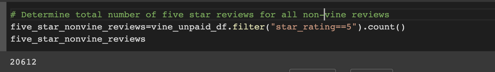

# Amazon_Vine_Analysis
## Overview

This project aims to analyze Amazon reviews written by members of the paid Amazon Vine program. Amazon Vine program is a service that allows manufacturers and publishers to receive reviews for their products.

The purpose of this analysis are;
- Create database in Amazon RDS
- Create tables for database in pgAdmin.
- Perform ETL on review dataset of pet products to extract the dataset, transform the dataset into dataframes in Google Colab Notebook.
- Make the connection to AWS RDS instance.
- Load the transformed data into their respective tables in pgAdmin.
- Determine if there is any bias toward favorable reviews from Vine members in the dataset

Dataset: US Reviews datasets for Pet Products from Amazon review datasets
URL link for data source:https://s3.amazonaws.com/amazon-reviews-pds/tsv/amazon_reviews_us_Pet_Products_v1_00.tsv.gz

Tools used: 
    - Google Colab 
    - AWS S3 and RDS
    - pgADMIN

## DELIVERABLE 1:Perform ETL on Amazon Product Reviews
Extract review dataset using PySpark

Transform dataset into four dataframes
- customer_id_table

 

- product_id_table

- review_id_table

- vine_table

## DELIVERABLE 2: Determine Bias of Vine Reviews

## Results
- VINE REVIEWS
    - 170 total paid reviews
    
    - 65 reviews were 5-star reviews
    
    - 38.23% of total vine reviews were 5-star reviews
    

- NON VINE REVIEWS
    - 37,840 total unpaid reviews
    
    - 20,612 reviews were 5-star reviews
    
    - 54.47% of total non vine reviews were 5-star reviews
    

## Summary

In conclusion, we can say that there is no positivity bias for reviews in the Vine program. 5-star reviews only account for 38.23% of total vine reviews whereas for non vine reviews, 5-star reviews accounted for more than 50% of the total unpaid reviews. So, paid program did not influence the user to provide positive ratings to that extent.

For the additional analysis, we can peform NLP Pipeline to analyse whether the user has used positive and touchy words on 5-star paid reviews.
